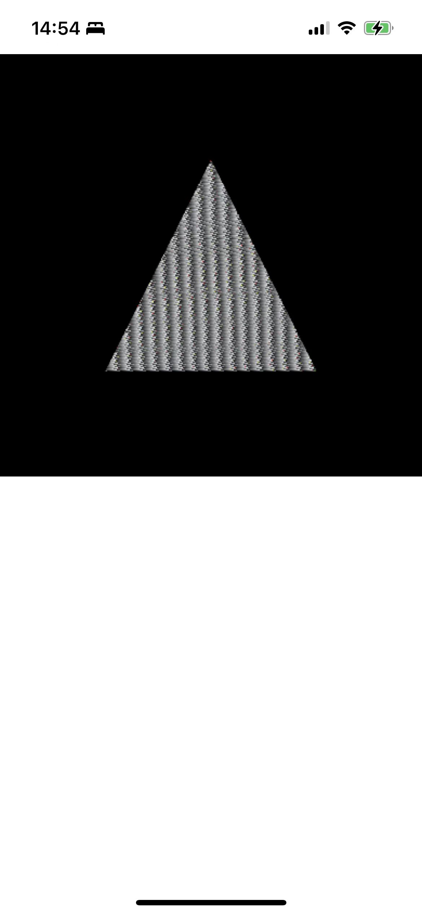

# build for ios

debug:

    mkdir build && cd build
    cmake .. -GXcode -DCMAKE_SYSTEM_NAME=iOS

release:

    mkdir build && cd build
    cmake .. -GXcode -DCMAKE_SYSTEM_NAME=iOS -DCMAKE_BUILD_TYPE=Release
    then in xcode -> edit scheme -> choose release

# demo

     

<!-- 

-->

# wgpu lib guide:

    check MyWGPUPassImp.cpp

# issues

    1. need call glDisable(GL_SCISSOR_TEST) after create device
    2. use libglslang compile glsl to spirv, then use tint to translate to glsl.
    3. origin tint coordinate system to flip y, and transform z[0,1] to [-1,1], here we comment it.
    

        

        

       

        
        

